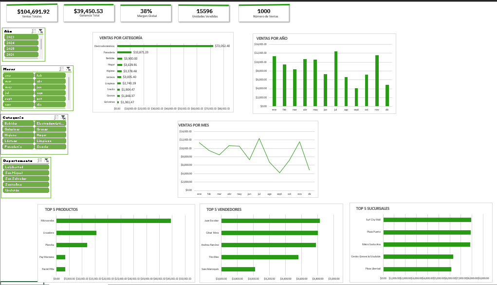

Dashboard de Ventas en Excel
Vista previa:

Descripción:
Dashboard interactivo desarrollado en Microsoft Excel para el análisis de ventas.
El proyecto permite explorar el desempeño comercial mediante KPIs, tablas dinámicas, segmentadores y gráficos interactivos.

KPIs incluidos:
- Ventas totales
- Ganancias totales
- Margen global
- Unidades vendidas
- Números de ventas

Filtros:
- Año
- Meses
- Categoría
- Departamento

Visualizaciones:
- Tendencia mensual de ventas
- Ventas por categoría
- Ventas por año
- Top productos
- Top vendedores
- Comparación de sucursals

Herramientas utilizadas:
- Microsoft Excel
- Tablas dinámicas
- Segmentadores
- Fórmulas
- Gráficos dinámicos

Archivos incluidos:
- MARKETPLACEXX.xlsx
- Productos.csv
- Sucursales.txt
- Vendedores.csv
- Productos.txt

Objetivo:
Proyecto desarrollado con fines de práctica para fortalecer habilidades de análisis de datos y construcción de dashboards en Excel.
